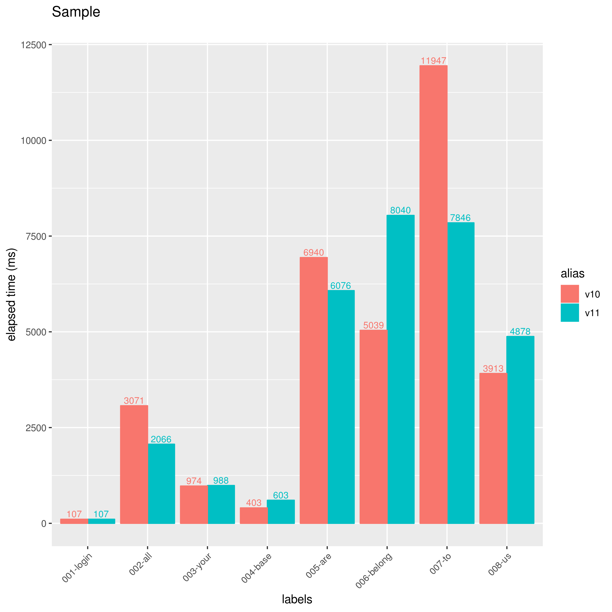
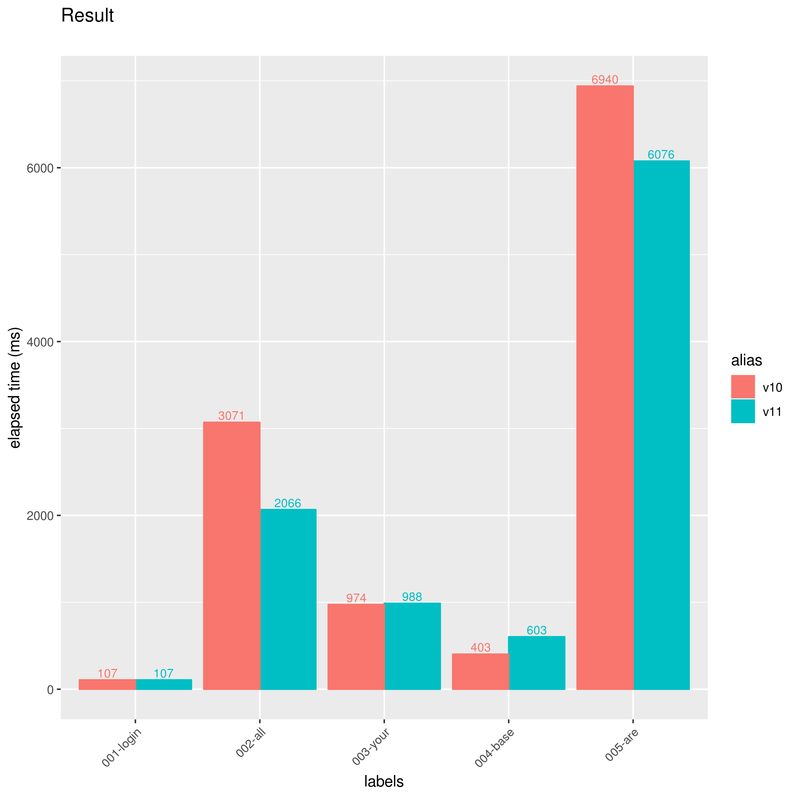
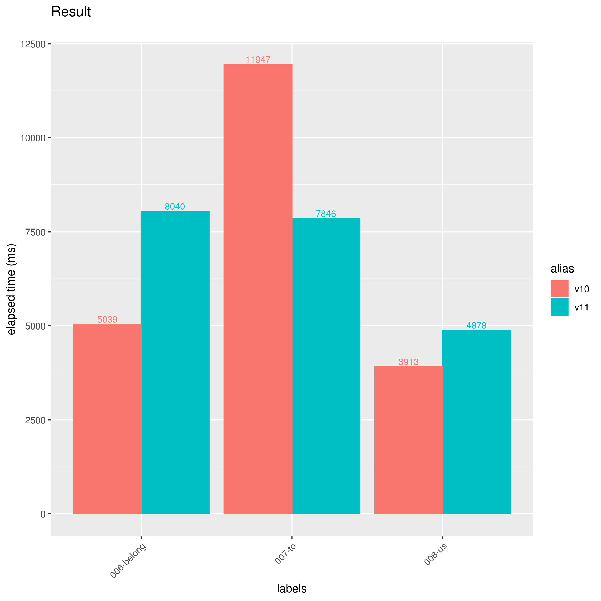
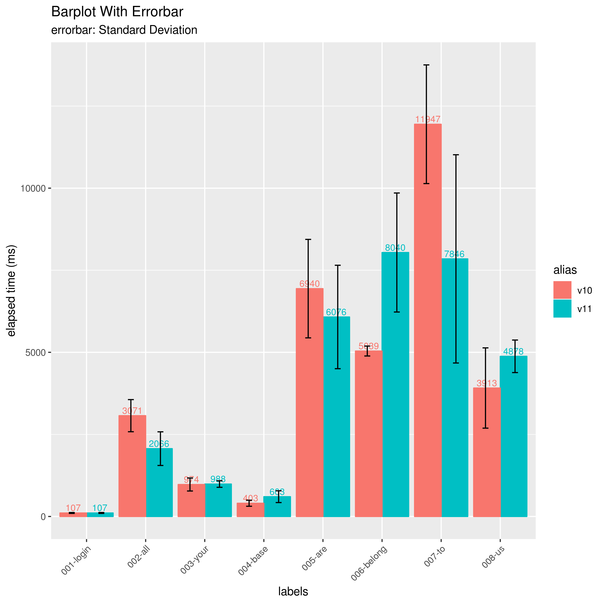
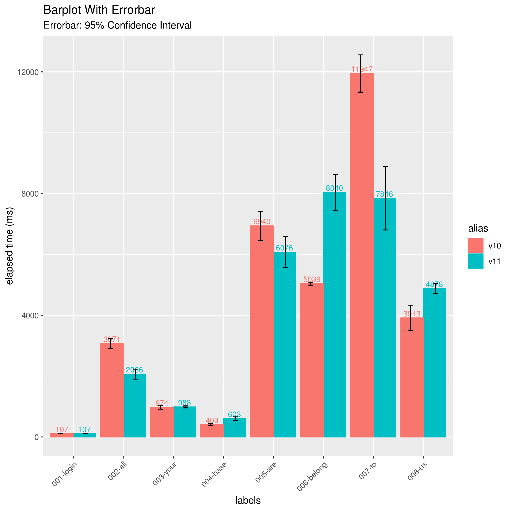
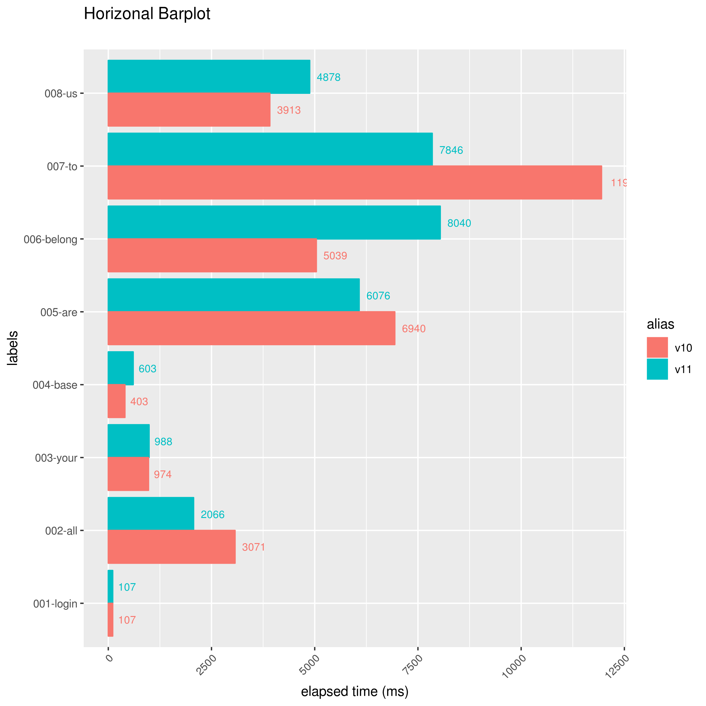

# BarplotterForJmeter

This is a tool for collecting multiple Jmeter result files (csv formatted jtl file) and generate barplot graph as image files.
This tool can be used to compare the results of performance evaluation.

## How to Install

```
devtools::install_github("ka-ka-xyz/BarplotterForJmeter")
```


## How to Use

### Generate Barplot Graph

```
library(BarplotterForJmeter)
results <- jbp_read(c(v10="sample/resources/v10_result.jtl", v11="sample/resources/v11_result.jtl"))
jbp_plot(results, title = "Sample")
```

These commands generate `result_1.png`.
The argument `title` (not required) means title of the graph.



### Divide Barplot Graph

Graph file will be divided into multiple files when result contains over 10 labels.
You can set size of limitation using argument `pagesize`.
And you can change prefix of graph file using argument `pic_prefix`.

```
jbp_plot(results, pagesize = 5, pic_prefix = "separate_")
```

These commands generate `separate_1.png` and `separate_2.png`.






### Add Errorbar

#### Errorbar (Standard Deviation)

You can add errorbar (standard deviation) into graph with argument `errorbar_type = "sd"`.

```
jbp_plot(results, errorbar_type = "sd", pic_prefix = "errorbar_sd")
```



#### Errorbar (95% Confidence Interval)

You can add errorbar (95% confidence interval) into graph with argument `errorbar_type = "ci"`.

```
jbp_plot(results, errorbar_type = "ci", pic_prefix = "errorbar_ci")
```



### Horizonal Barplot

You can generate horizonal barplot graph with argument `horizonal = T`.

```
jbp_plot(results, horizonal = T, pic_prefix = "horizonal_")
```


