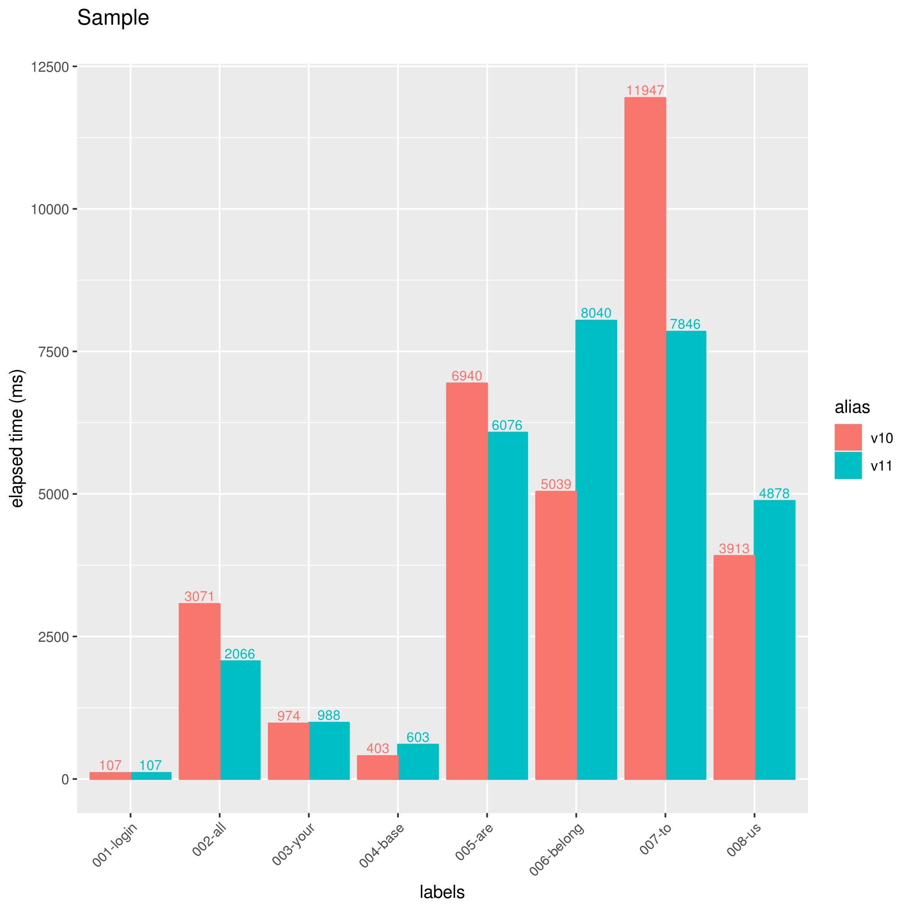
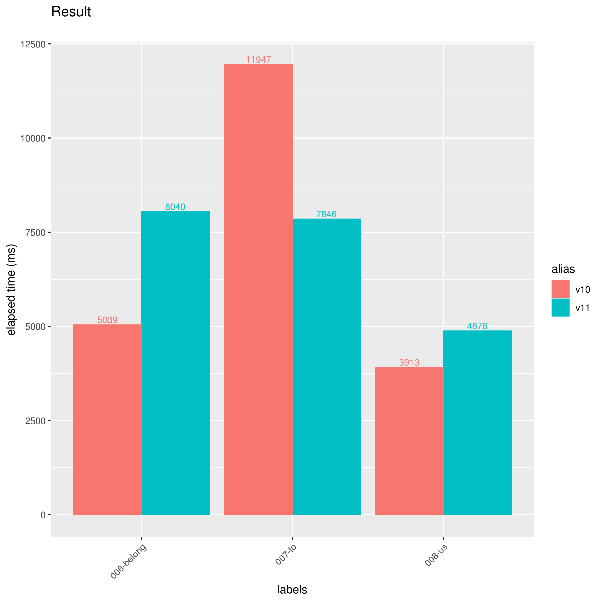
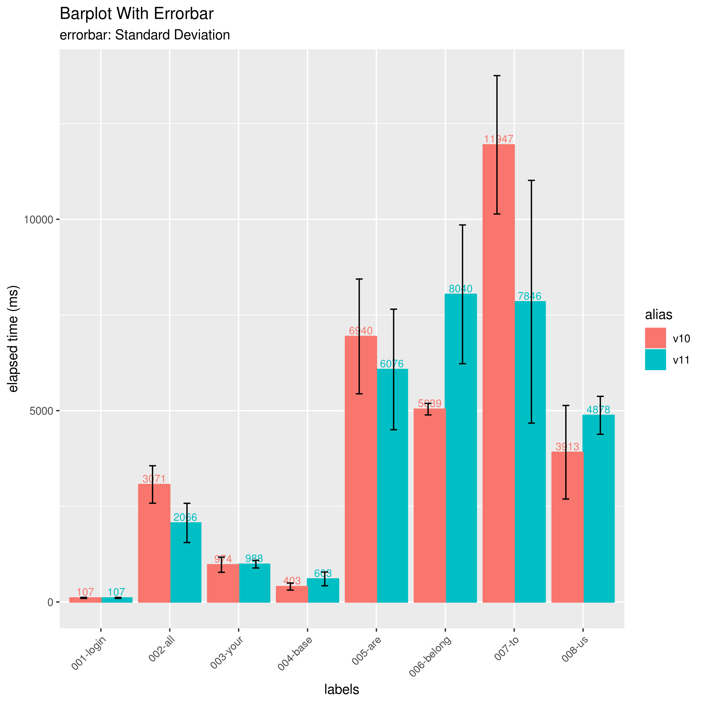
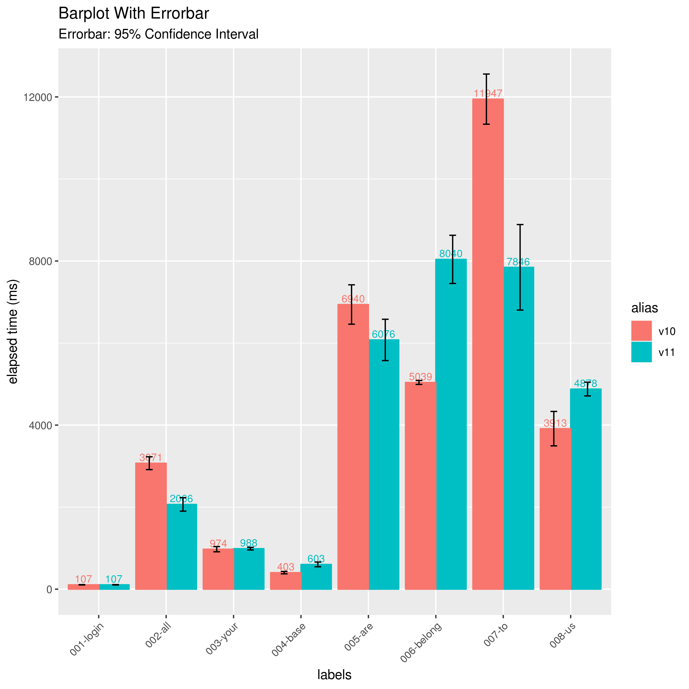

# BarplotterForJmeter

複数のJmeter結果ファイル(csv形式のjtlファイル)をまとめてバープロットグラフとして画像ファイルへ出力するためのツールです。
jmeterの結果を比較するために使えます。

## インストール方法

```
devtools::install_github("ka-ka-xyz/BarplotterForJmeter")
```


## 使い方

### バープロットを描く

まず、以下のサンプルデータをワークディレクトリへ保存します。

- sample/resources/v10_result.jtl
- sample/resources/v11_result.jtl

次に以下のコマンドを実行します。

```
library(BarplotterForJmeter)
results <- jbp_read(c(v10="sample/resources/v10_result.jtl", v11="sample/resources/v11_result.jtl"))
jbp_plot(results, title = "Sample")
```

ファイル`result_1.png`が生成されます。
引数`title`でグラフのタイトルを指定する事ができます。



### 分割する

10個以上のラベルが存在する場合、グラフは複数の画像に分割されます。
引数`pagesize`で分割サイズを指定することも可能です。
また、引数`pic_prefix`で画像ファイルのprefixを指定することもできます。

```
jbp_plot(results, pagesize = 5, pic_prefix = "separate_")
```

ファイル`separate_1.png`と`separate_2.png`が生成されます。





### エラーバーを描く

#### エラーバー(標準偏差)

引数`errorbar_type = "sd"`を指定することで、エラーバー(標準偏差)を追加することができます。

```
jbp_plot(results, errorbar_type = "sd", title = "Barplot With Errorbar", pic_prefix = "errorbar_sd")
```



#### エラーバー(95% 信頼区間)

引数`errorbar_type = "ci"`を指定することで、エラーバー(95% 信頼区間)を追加することができます。

```
jbp_plot(results, errorbar_type = "ci", title = "Barplot With Errorbar", pic_prefix = "errorbar_ci")
```



### 水平バープロットを描く

引数`horizonal = T`を指定することで、水平バープロットを出力することも可能です。

```
jbp_plot(results, horizonal = T, title = "Horizonal Barplot", pic_prefix = "horizonal_")
```


